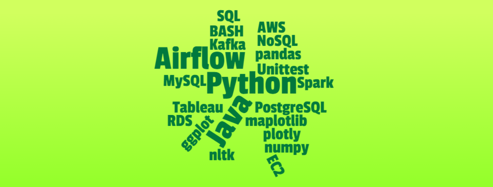
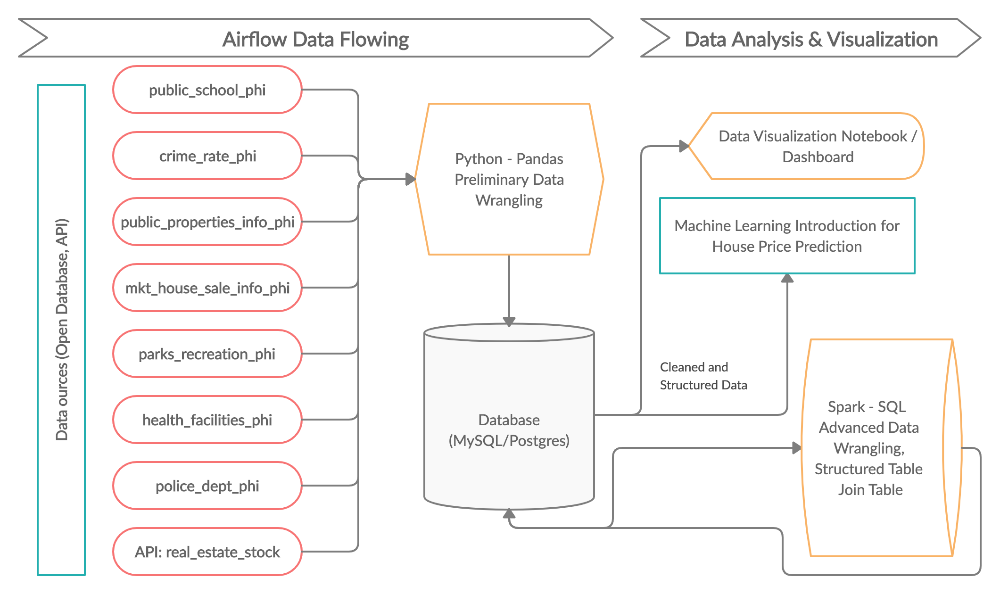
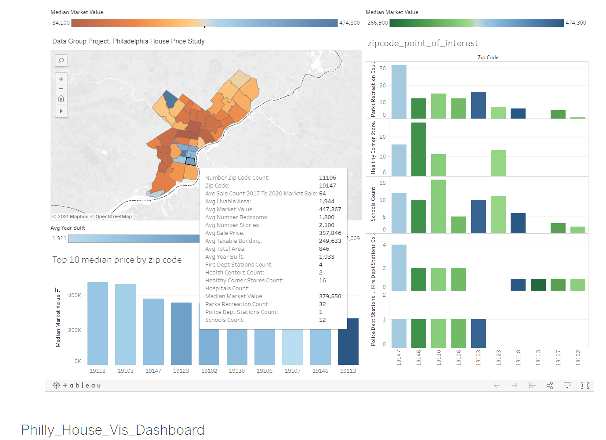
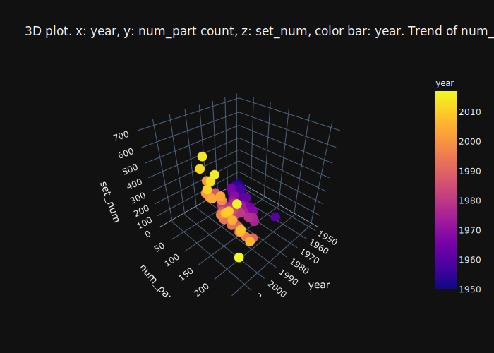
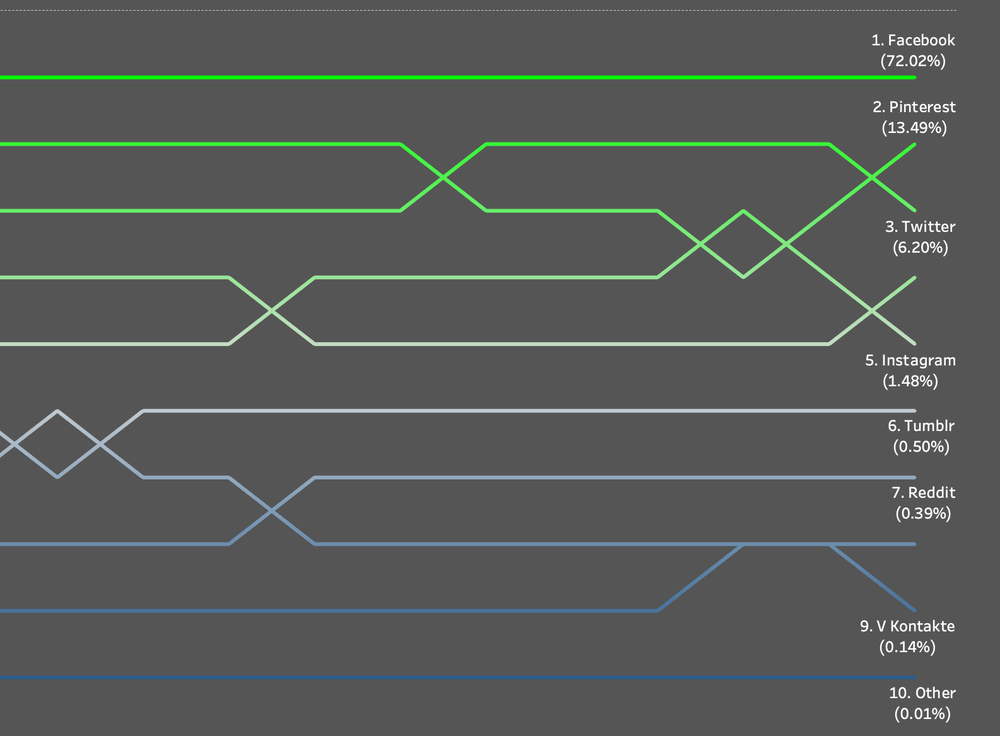
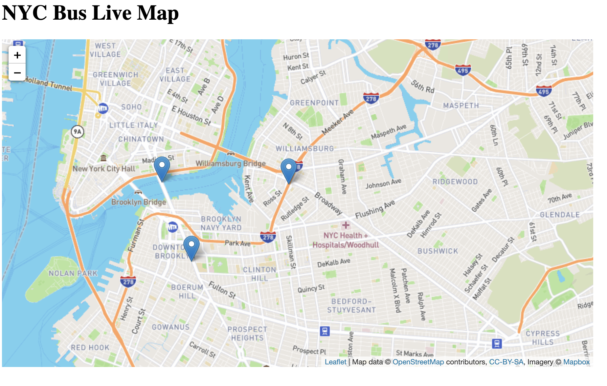
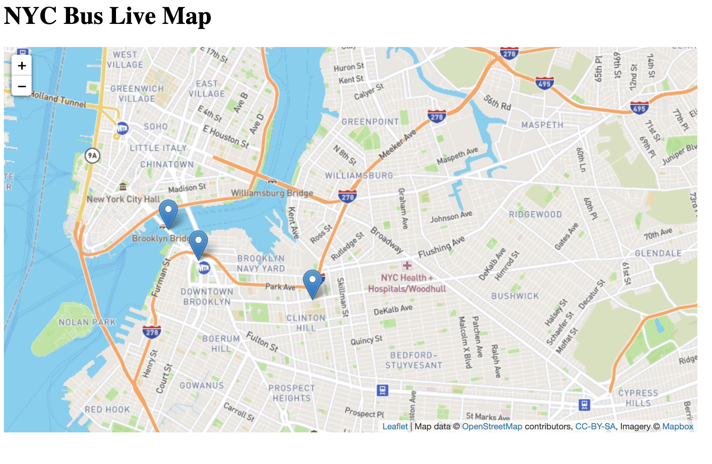
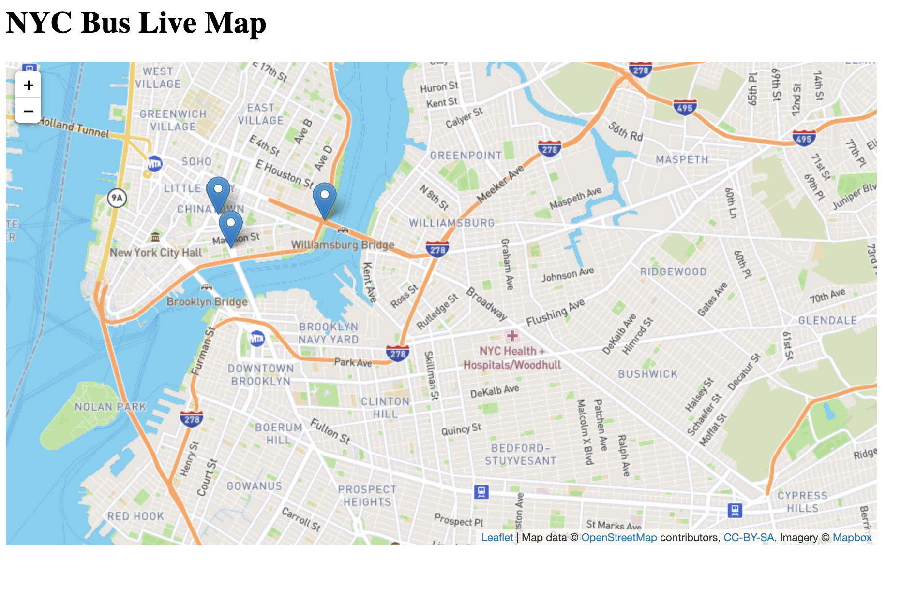

<b>Welcome to Norton's Data World<b>

| Project List| 
| ------ |
| [1. NYC Open Data 2025: NYC Propery Sales (2019-2023) End to End Data Pipeline End2End Run Report ](#NYC-Propery-Sales-(2019-2023)-End-to-End-Data-Pipeline-End2End-Run-Report)|
| [2. Non-Traditional Housing Price Predictor in Philadelphia City (Data Group Project) ](#Non-Traditional-Housing-Price-Predictor-in-Philadelphia)|
| [3. Airflow Pipeline: New York City Airbnb Home Selection](#Airflow-Pipeline-New-York-City-Airbnb-Home-Selection)|
| [4. Alternative Data Engineering Tools Research](#Alternative-Data-Engineering-Tools-Research)|
| [5. Black Jack Game](#Black-Jack-Game)|
| [6. Tableau Public Data Visualization](#Tableau-Public-Data-Visualization)|
| [7. Kafka: NYC Bus Live Map](#Kafka-NYC-Bus-Live-Map)|

### [Non-Traditional Housing Price Predictor in Philadelphia](https://github.com/nortonlyr/ZCW.DataGroupProject)   

- View the data visualization report of group project at (https://app.luminpdf.com/viewer/5ecc6da18124240012ae0885)
- [Group Project Cover Page](https://malbt.github.io/ZCW.DataGroupProject/) 
- [Tableau Dashboard for Philadelphia House Price Data Visualization](https://public.tableau.com/profile/norton.li#!/vizhome/Philly_House_Vis_Dashboard/Dashboard1?publish=yes)
- Language: Python
- Data Pipeline and Automation: Apache Airflow
- Data Cleaning: Pandas
- Data Storage: MySQL
- Data Transformation (Join Table): Apache Spark (SQL) - Cluster @ Databricks  
- Data Visualization: Jupyter Notebook: Matplotlib -> (heatmap), seaborn -> (pairplot, boxplot), plotly -> (3D plot), Tableau Public-> dashboard

  

---
### [Airflow Pipeline New York City Airbnb Home Selection](https://github.com/nortonlyr/DataEngineering.Labs.AirflowProject)

- Language: Python
- Apache Airflow
- Pandas
- Matplotlib
- MySQL / PostgreSQL
- Jupyter Notebook Report
- AWS (S3, EC2, RDS)

---
### [Alternative Data Engineering Tools Research](https://github.com/nortonlyr/Week9-ResearchProjects)  

- Language: R
- NoSQL Database: MongoDB
- Visualization Tools: ggplot2, plotly -> (3D plot)
- In this project (LEGO dataset), I applied both R-Studio and jupyter notebook to import and export data from MongoDB, then used ggplot2 and plotly to demonstrate the analytical reslut with data visualization, respectively.
  

---
### [Black Jack Game](https://github.com/nortonlyr/PythonFundamentals.Labs.BlackJack)   
  
- Language: Python
- Class
- Unit Testing
- Object Oriented Programming
- Terminal
- In this project, I applied unit-test tool to verify the classes and modules in the Black Jack Application.  

---  

---
### [Tableau Public Data Visualization](https://public.tableau.com/profile/norton.li#!/)   
  
- [Social Media Top 10 (05/19 - 05/20)](https://public.tableau.com/profile/norton.li#!/vizhome/Social_Media_19to20_Vis01/Social_Media_19to20_Vis_01)

- [US Museums Data](https://public.tableau.com/profile/norton.li#!/vizhome/US_Museums_Dashboard/US_Museum_Dashboard)

---  

---
### [Kafka NYC Bus Live Map](https://github.com/nortonlyr/Kafka_Live_Map)   
  
In this repo, Apache Kafka is used for tracking the route of the designed buslines. When we run the three different busdata producers python files, you will see three different moving spots in the map.

Environment & tools:

- Python 3.70 (pykafka, flask, JSON)
- Apache Kafka
- Javascript (Leaflet.JS)
- html

---  

Thank you for visiting. More projects are coming
  
